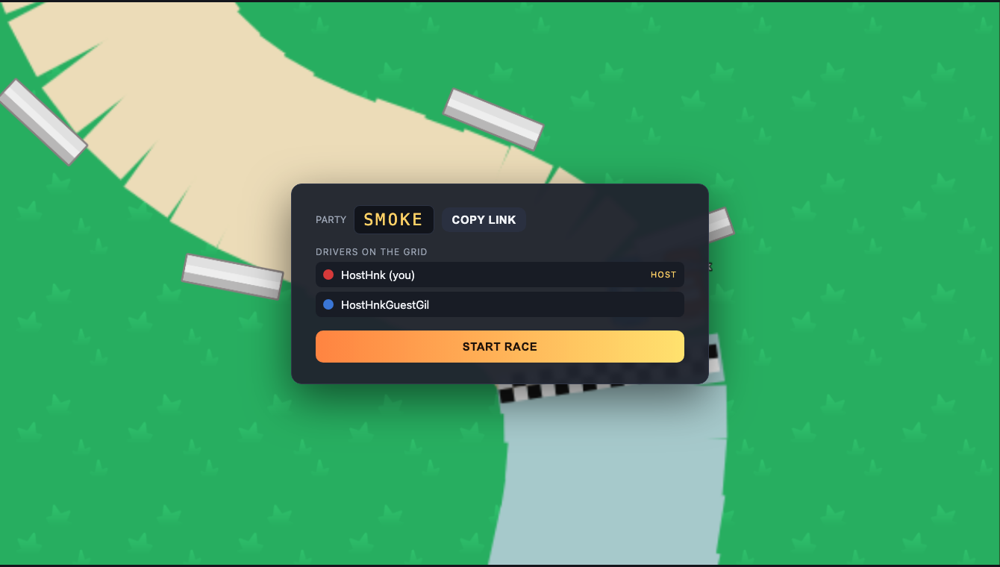

# 🏁 RALLY

A 2D **top-down rally racing** game with arcade drifting — think *art of rally*,
but 2D and **free-for-all multiplayer**. Procedurally generated tracks, four road
surfaces that change how the car grips, satisfying handbrake drifts with dust and
skid marks, and an authoritative server so any number of players can start
together and shove each other off the road.



## Features

- **Arcade drift physics** — velocity splits into forward/lateral; surface grip
  kills the slide, the handbrake lets it go. Heading rotates faster than grip can
  realign you, so you drift. Low-grip surfaces drift longer.
- **Four surfaces, each handles differently** — Tarmac (grippy/fast), Gravel,
  Sand, and Snow (slidey). Dust and skid effects are tinted per surface.
- **Procedural tracks** — every race is a fresh, smooth closed loop generated
  from a seed (deterministically, so client and server build the identical
  track from just the seed).
- **Free-for-all multiplayer** — no arbitrary player cap. Everyone starts on a
  grid at the same time and races the same laps, bumping and pushing each other.
- **Art-of-rally style resets** — drift too far off the road, or sit still too
  long, and you’re respawned in the middle of the road facing forward.
- **Juice** — engine + tyre-skid audio synthesised live from your speed/slip,
  collision sparks + screen shake, drift dust, baked skid marks, countdown
  banner, dynamic speed-zoom, music.
- **Shareable party links** — a private race is just a URL with `?code=XXXX`.

## Controls

| Action | Keys |
| --- | --- |
| Accelerate | `↑` / `W` |
| Brake / reverse | `↓` / `S` |
| Steer | `←` `→` / `A` `D` |
| Handbrake (drift!) | `Space` |
| Mute | `M` |

## Run it

```bash
npm install
npm run dev      # server on :2567, client on :5173
```

Open http://localhost:5173. **Quick Play** matchmakes you into a shared race;
**Create Private Race** gives you a code/link to send friends. The host presses
**Start Race**.

Production build:

```bash
npm run build:client   # -> dist/client
npm start              # serves the built client + game server on :2567
```

## Architecture

Game logic is fully decoupled from the engine and the network so an entire race
can be played in a unit test.

```
src/
  shared/   # pure & isomorphic — RNG, constants, surfaces, procedural track,
            #   arcade physics, Colyseus schema, protocol
  sim/      # RaceSimulation: authoritative, engine-agnostic race advanced by
            #   tick(dt); + a headless PNG renderer + oMLX client (visual QA)
  server/   # thin Colyseus Room wrapping the sim + entry point
  client/   # Phaser scenes (boot/race), HTML lobby, net wrapper, audio synth
tests/      # vitest: shared, physics, sim (full-race playthrough), room
            #   integration, + gated *.omlx.test.ts
scripts/    # puppeteer end-to-end smoke + visual QA helpers
```

The physics `stepCar` and the `RaceSimulation` operate directly on the Colyseus
schema (which works standalone), so there’s no server↔sim copying and the same
code runs in tests, on the server, and feeds the client.

## Testing & verification

```bash
npm test            # hermetic unit + integration (31 tests)
npm run typecheck
npm run smoke       # headless-browser end-to-end (needs `npm run dev` running)
npm run test:visual # gated oMLX "does it look right?" check (needs local oMLX)
```

- **`tests/sim.test.ts`** plays a full 3-lap, multi-car race with an AI driver
  entirely in-process — the litmus test that the architecture is right.
- **`tests/room.test.ts`** drives two real Colyseus clients (shared rooms by
  code, host start, server-side input integration).
- **`scripts/smoke-e2e.mjs`** boots real browsers: two clients share a room,
  then a client races and we assert authoritative progress + screenshot.

## Credits

Art & audio: **[Kenney](https://kenney.nl)** — Racing Pack, Smoke Particles,
Impact/Interface Sounds, Music Loops. All **CC0** (public domain). The snow tile
and collision spark are generated at runtime. Snow dust spray uses Kenney’s
white-puff particle.

Built with TypeScript, [Phaser 3](https://phaser.io),
[Colyseus](https://colyseus.io), and Vite.
